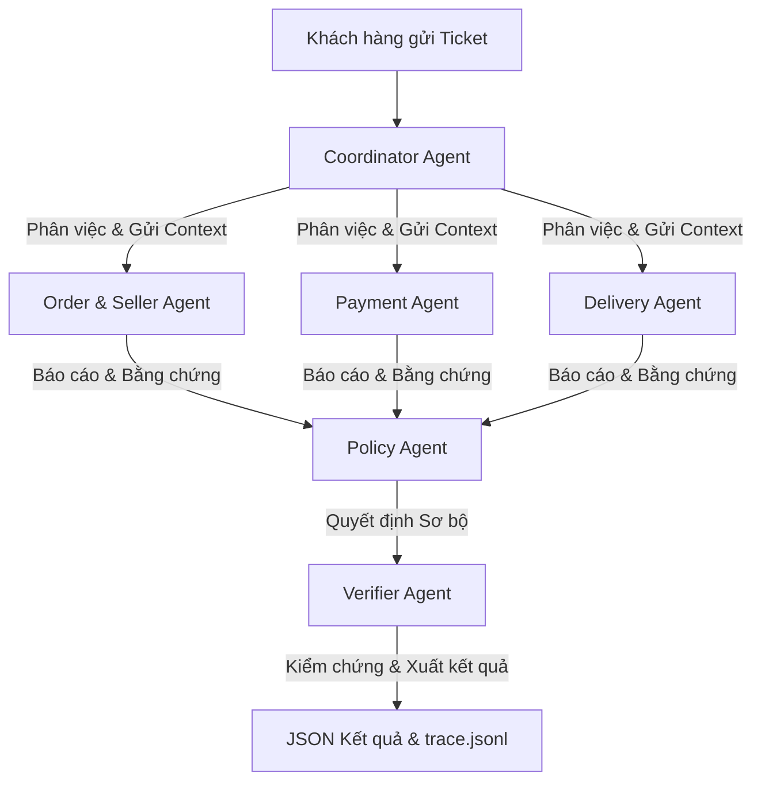

# Kiến trúc Hệ thống Multi-Agent Giải quyết Khiếu nại Olist (EC_POLICY_V1)

Hệ thống này được xây dựng trên mô hình Multi-Agent phối hợp, trong đó mỗi Agent đảm nhiệm một vai trò chuyên môn hóa nhằm điều tra và ra quyết định xử lý khiếu nại của khách hàng thương mại điện tử Olist một cách tự động, chính xác và minh bạch.

## 1. Sơ đồ hoạt động (Multi-Agent Flow)

---

## 2. Vai trò và Quyền truy cập dữ liệu của từng Agent

| Tên Agent | Vai trò chính | Nguồn dữ liệu truy cập | Output đầu ra / Bằng chứng (Evidence ID) |
| :--- | :--- | :--- | :--- |
| **Coordinator Agent** | Tiếp nhận ticket, điều phối công việc cho các Agent nghiệp vụ và tổng hợp luồng chạy. | File đầu vào (`input/*.json`) | Khởi chạy luồng và kết xuất file kết quả cuối cùng. |
| **Order & Seller Agent** | Phân tích trạng thái đơn hàng; so sánh ngày giao hàng cho shipper và hạn giao hàng của seller để xác định seller có giao trễ không. | `olist_orders_dataset.csv` `olist_order_items_dataset.csv` `olist_sellers_dataset.csv` | Báo cáo chi tiết trễ người bán. Bằng chứng: `order:<order_id>`, `item:<order_id>:<item_id>`, `seller:<seller_id>` |
| **Payment Agent** | Tính toán tổng tiền khách đã thanh toán, đối soát với giá trị thực tế của đơn hàng (tiền hàng + tiền ship), phát hiện thanh toán chia đợt. | `olist_order_payments_dataset.csv` `olist_order_items_dataset.csv` | Báo cáo đối soát tài chính. Bằng chứng: `payment:<order_id>:<payment_sequential>` |
| **Delivery Agent** | So sánh ngày giao hàng thực tế cho khách với ngày dự kiến giao hàng để xác định đơn hàng có bị vận chuyển trễ không. | `olist_orders_dataset.csv` | Báo cáo trễ vận chuyển. Bằng chứng: `order:<order_id>` |
| **Policy Agent** | Nhận báo cáo từ các Agent nghiệp vụ, đối chiếu nghiêm ngặt theo thứ tự ưu tiên của chính sách `EC_POLICY_V1` để ra quyết định hoàn tiền. | Dữ liệu tổng hợp từ các Agent nghiệp vụ | Quyết định xử lý: hoàn bao nhiêu, lỗi do ai. Bằng chứng: `policy:<root_cause_code>` |
| **Verifier Agent** | Kiểm tra chéo dữ liệu đầu ra: Xác thực các mã bằng chứng có tồn tại trong dữ liệu gốc không, kiểm tra schema JSON nộp bài. | Toàn bộ dữ liệu đơn hàng và quyết định | JSON sạch lỗi, danh sách lỗi (nếu có). |

---

## 3. Luồng Chuyển giao thông tin (Handoff Mechanism)

Hệ thống hoạt động theo mô hình chuyển tiếp dữ liệu có cấu trúc:
1. **Coordinator** truy vấn thông tin gốc của đơn hàng từ cơ sở dữ liệu (`db.py`) và tạo một gói ngữ cảnh (`order_ctx`).
2. **Order & Seller Agent**, **Payment Agent**, và **Delivery Agent** chạy song song độc lập, sử dụng gói ngữ cảnh này để thực hiện nghiệp vụ chuyên môn và trả về các báo cáo phân tích kèm bằng chứng xác thực.
3. **Policy Agent** nhận toàn bộ báo cáo từ 3 Agent trên, áp dụng chính sách `EC_POLICY_V1` để đưa ra giải pháp đề xuất.
4. **Verifier Agent** đóng vai trò là chốt chặn cuối cùng, rà soát lại độ chính xác của các mã ID bằng chứng và lọc bỏ các dữ liệu rác trước khi lưu file kết quả.
5. Biên bản cuộc họp trao đổi giữa các Agent được ghi lại đầy đủ vào `trace.jsonl` tại thời điểm chạy.

---

## 4. Mô hình sử dụng (Model Configurations)
* **Tên mô hình:** `gemini-3.5-flash-lite` (sử dụng qua Google Gen AI API).
* **Kích thước mô hình:** Dòng Lite được tối ưu hóa cho tác vụ nhẹ, số lượng tham số dưới 10 tỷ (under 10B parameters), đảm bảo tuân thủ 100% quy định của BTC.
* **Thời gian chạy:** ~1-2 giây cho mỗi case, đảm bảo hiệu suất cao.
