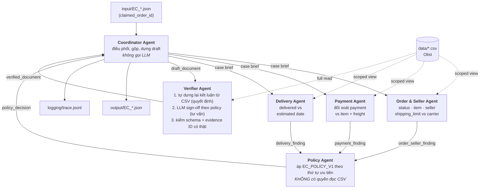

# Architecture — Multi-Agent E-commerce Dispute Resolution

Sáu agent điều tra 50 khiếu nại Olist. Mỗi agent sở hữu một domain dữ liệu, chỉ
truy cập được đúng phần dữ liệu của mình, và bàn giao kết luận qua message
envelope (`Handoff`) thay vì chia sẻ state. Toàn bộ agent chạy trên model
**≤ 10B tham số** (`meta-llama/llama-3.1-8b-instruct`, 8B, qua OpenRouter).

## 1. Sơ đồ agent



Ba domain agent chạy song song (`AGENT_WORKERS=3`); 50 case chạy song song
(`CASE_WORKERS=4`).

## 2. Vai trò và quyền truy cập dữ liệu

Quyền truy cập được **cưỡng chế trong code**, không phải quy ước:
`OlistStore.view(agent_name)` trả về một `ScopedStore` chỉ expose đúng các tool
trong `AGENT_SCOPES` (`src/olist_store.py`). Gọi ngoài scope → `AccessDenied`.
Mọi tool call đều được ghi vào `trace.jsonl` kèm tên agent.

| Agent | Vai trò | Tool được cấp | Bảng dữ liệu chạm tới |
| --- | --- | --- | --- |
| `coordinator_agent` | Điều phối, fan-out/fan-in, dựng draft, ghi file | `get_case_index` | `orders` (chỉ kiểm tra tồn tại) |
| `order_seller_agent` | Trạng thái đơn, item, seller, mốc bàn giao | `get_order_core`, `get_order_items`, `get_seller_profiles` | `orders`, `order_items`, `sellers` |
| `payment_agent` | Đối soát payment với item + freight | `get_payments`, `get_item_charge_totals` | `order_payments`, `order_items` |
| `delivery_agent` | Giao thực tế vs hạn cam kết | `get_delivery_timeline` | `orders` |
| `policy_agent` | Phân loại theo EC_POLICY_V1 | *(không có)* | *(không có)* |
| `verifier_agent` | Tái dựng độc lập, kiểm schema + evidence | toàn bộ + `entity_exists` | tất cả |

**Policy Agent cố tình không có quyền đọc CSV.** Nó chỉ được suy luận trên ba
handoff nhận về. Đây là điểm khiến handoff có ý nghĩa thật: kết luận phải bảo vệ
được bằng bằng chứng agent khác đã trình ra, không phải bằng một lần tự tra dữ liệu.

## 3. Luồng handoff

Agent không đọc state của nhau. Chúng trao đổi `Handoff` (`src/protocol.py`):
payload + provenance (agent gửi, model nào, đã gọi tool nào, có bị degrade không).

| # | Từ → Đến | `intent` | Nội dung chính |
| --- | --- | --- | --- |
| 1 | coordinator → 3 domain agent | *(case brief)* | `case_id`, `order_id`, message khách |
| 2 | order_seller → policy | `order_seller_finding` | status, item/seller ids, item & freight total, `seller_handoff_late`, `late_seller_ids` |
| 3 | payment → policy | `payment_finding` | số payment row, `payment_total_brl`, `is_split_payment`, `delta_brl`, `reconciled` |
| 4 | delivery → policy | `delivery_finding` | `delivered`, `delivered_after_estimate`, `days_late` |
| 5 | policy → coordinator | `policy_decision` | `primary_issue`, root cause, bên chịu trách nhiệm, refund, action, confidence |
| 6 | coordinator → verifier | `draft_document` | document đầy đủ dựng từ (2)(3)(4)(5) — **chưa kiểm chứng** |
| 7 | verifier → coordinator | `verified_document` | document đã sửa + danh sách `repairs` + kết quả sign-off |

Mỗi bước phát một dòng `handoff` trong `trace.jsonl`, nên có thể tái dựng lại
toàn bộ cuộc "hội thoại" giữa các agent cho từng case.

## 4. Nguyên tắc thiết kế: LLM đề xuất, dữ liệu phán quyết

Đây là bài toán compliance: sai một con số là sai cả case, và evidence ID bịa ra
bị tính false positive. Vì vậy hệ thống tách rõ hai loại phán đoán.

**LLM 8B thực sự quyết định**, không chỉ chép lại: prompt của các domain agent
**giấu đi** những cờ mà store đã tính sẵn (`handoff_after_limit`,
`delivered_after_estimate`), buộc model tự so sánh timestamp; Payment Agent phải
tự cộng tiền và tự áp ngưỡng 0.10 BRL; Policy Agent phải tự chạy bảng ưu tiên.

**Dữ liệu phán quyết cuối**: Verifier chạy `src/ground_truth.py`, một bộ máy suy
luận độc lập đọc thẳng CSV và áp lại EC_POLICY_V1 từ đầu, *không nhìn* ý kiến
agent nào. Chỗ nào draft lệch, Verifier sửa và ghi `verifier_override` vào trace.
Nhờ vậy độ chính xác thật của pipeline LLM luôn đo được
(`quality.llm_pipeline_matched_verifier` trong `metadata.json`), thay vì bị giấu
sau một con số accuracy đẹp.

Hai ngoại lệ có chủ ý:

- **Định danh (item_ids / seller_ids / payment_ids) lấy trực tiếp từ dữ liệu**,
  không để model sinh. Rủi ro lớn nhất của mô hình 8B ở bài này là bịa ID; mà ID
  bịa vừa mất điểm evidence vừa bị tính false positive. Không có lợi ích nào đủ bù.
- **LLM sign-off của Verifier là tư vấn**, không phải quyết định. Nó phát hiện mâu
  thuẫn chính sách và làm giảm `confidence`, nhưng không được lật một sự kiện đã
  tái dựng từ CSV. Sự kiện đến từ dữ liệu, không đến từ model.

## 5. Chống bịa sự kiện

- Prompt mọi agent đều cấm suy diễn refund ledger, transaction ID, tracking
  checkpoint theo item, bằng chứng giao sai/thiếu — đúng như README nói Olist
  không có các dữ liệu này.
- `assembly.validate_document` kiểm mọi evidence ID bằng regex **và** bằng
  `entity_exists` tra ngược vào CSV. ID sai định dạng hoặc không tồn tại bị chặn
  trước khi ghi file.
- Đơn không có item row (8 case `unavailable`) → `item_ids`/`seller_ids` rỗng,
  `item_total_brl`/`freight_total_brl` = `0.0`, đúng mục 6 của đề.
- Khiếu nại của khách chỉ là *đầu vào cần kiểm chứng*: 9/50 case kết luận
  `unsupported_late_claim` vì dữ liệu cho thấy đơn giao đúng cam kết.

## 6. Độ bền khi chạy thật

| Sự cố | Xử lý |
| --- | --- |
| 429 / 5xx / timeout | Retry rồi tụt xuống model kế trong `MODEL_POOL` — mọi model trong pool đều ≤ 10B nên fallback không bao giờ phá ràng buộc đề bài |
| Model trả JSON kèm prose/fence | Bóc fence + lấy object ngoài cùng; hỏng thì hỏi lại một lần với yêu cầu chặt hơn (đếm vào `json_repairs`) |
| LLM chết hẳn ở một agent | Agent degrade sang deterministic fallback, đánh dấu `grounded=false` trong handoff và `llm_failure` trong trace |
| Một case ném exception | Case đó được `ground_truth` dựng lại, ghi `case_recovered` vào trace; cả batch không đổ |

## 7. Bản đồ file

```
run.py                      entry point: --self-check | chạy thật
src/config.py               model pool (≤10B), sampling, path, cap của schema
src/olist_store.py          nạp CSV + scoped view cưỡng chế quyền truy cập
src/llm.py                  chat client OpenAI-compatible (stdlib), fallback model, ép JSON
src/protocol.py             Handoff / CaseContext — envelope A2A
src/policy.py               EC_POLICY_V1 dạng dữ liệu (dùng chung cho prompt & verifier)
src/ground_truth.py         bộ máy tái dựng độc lập của Verifier
src/assembly.py             dựng document, áp cap, validate schema + evidence
src/tracing.py              writer trace.jsonl
src/agents/                 6 agent
logging/trace.jsonl         trace của lần chạy mới nhất (ghi đè, không append)
logging/metadata.json       model, parameter size, framework, runtime, quality
output/EC_001..050.json     kết quả nộp
```

## 8. Cách chạy

```bash
cp .env.example .env        # điền OPENROUTER_API_KEY
python3 run.py --self-check # kiểm bộ máy deterministic + schema, không gọi API
python3 run.py              # chạy thật 50 case
```

Không cần cài thêm dependency: toàn bộ chạy trên standard library của Python 3.9+.

## 9. Kết quả lần chạy mới nhất

> Điền tự động từ `metadata.json` sau mỗi lần chạy thật — xem
> `logging/metadata.json` mục `quality` và `runtime`.
